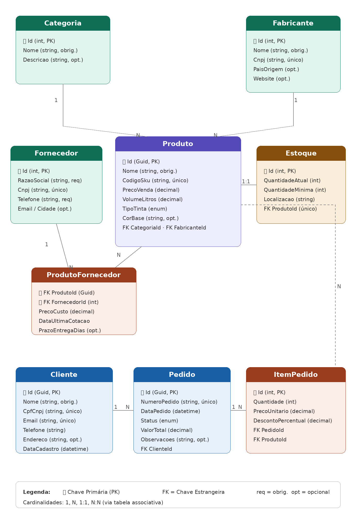

# LojaTintas — CP1 + CP2

## Integrantes

| Nome | RM |
|------|-----|
| Andrei de Paiva Gibbini | 563061 |
| Diogo Cunha Abrão de Oliveira | 563654 |

---

## Domínio

Sistema de gerenciamento para uma loja de tintas: cadastro de produtos, controle de estoque, pedidos de venda e relacionamento com fornecedores e fabricantes.

## Entidades

| Entidade | PK |
|---|---|
| `Categoria` | `int Id` |
| `Fabricante` | `int Id` |
| `Produto` | `Guid Id` |
| `Estoque` | `int Id` |
| `Fornecedor` | `int Id` |
| `ProdutoFornecedor` | `(Guid ProdutoId, int FornecedorId)` |
| `Cliente` | `Guid Id` |
| `Pedido` | `Guid Id` |
| `ItemPedido` | `int Id` |

## Relacionamentos

| Relacionamento | Cardinalidade |
|---|---|
| Categoria → Produto | 1:N |
| Fabricante → Produto | 1:N |
| Produto → Estoque | 1:1 |
| Produto ↔ Fornecedor | N:N via `ProdutoFornecedor` |
| Cliente → Pedido | 1:N |
| Pedido → ItemPedido | 1:N |
| Produto → ItemPedido | 1:N |

## Arquitetura

Clean Architecture em 4 projetos:

- **Domain** — entidades e enums, sem dependências externas
- **Application** — interfaces dos repositórios
- **Infrastructure** — EF Core, DbContext, Fluent API, implementações
- **API** — entry point, DI, endpoints mínimos

## Banco de Dados

SQLite — arquivo `loja_tintas.db` criado automaticamente na raiz da API.

```json
{
  "ConnectionStrings": {
    "DefaultConnection": "Data Source=loja_tintas.db"
  }
}
```

## Como executar

```bash
dotnet restore

dotnet ef database update --project LojaTintas.Infrastructure --startup-project LojaTintas.API

dotnet run --project LojaTintas.API
```

## Endpoints

| Método | Rota | Descrição |
|--------|------|-----------|
| `GET` | `/health` | Health check |
| `GET` | `/api/produtos` | Lista produtos |
| `GET` | `/openapi/v1.json` | Spec OpenAPI |

## Diagrama MER


